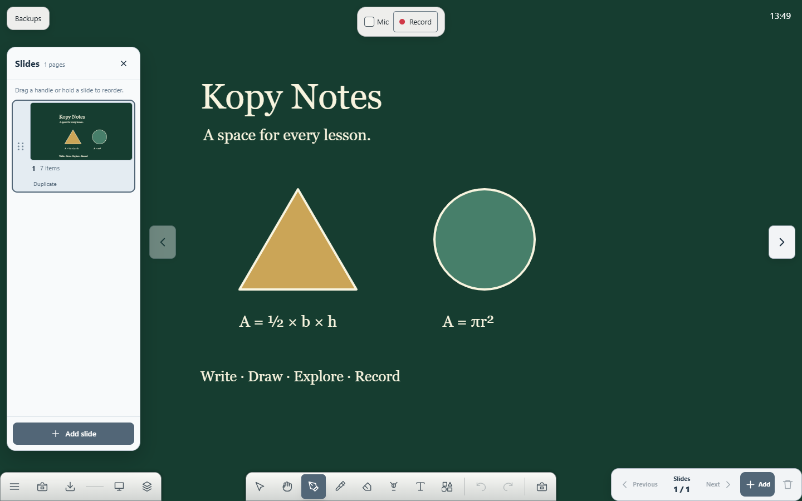
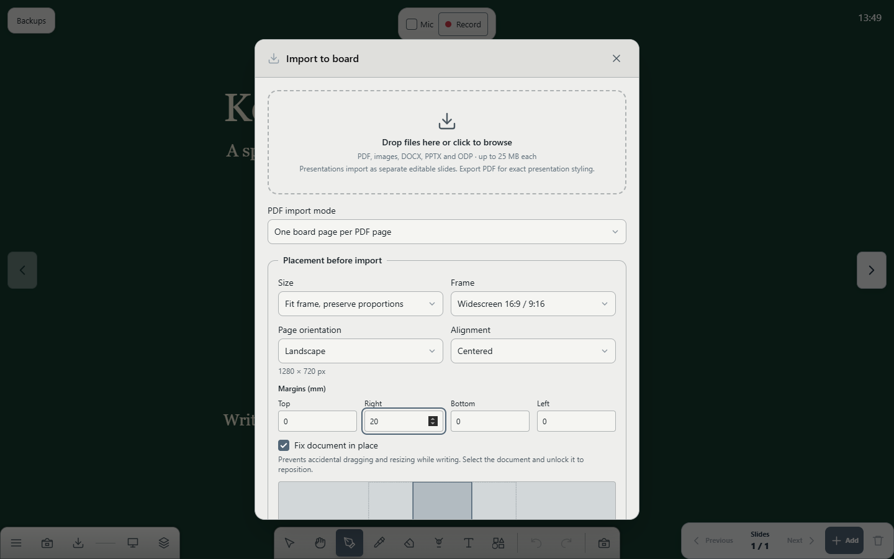
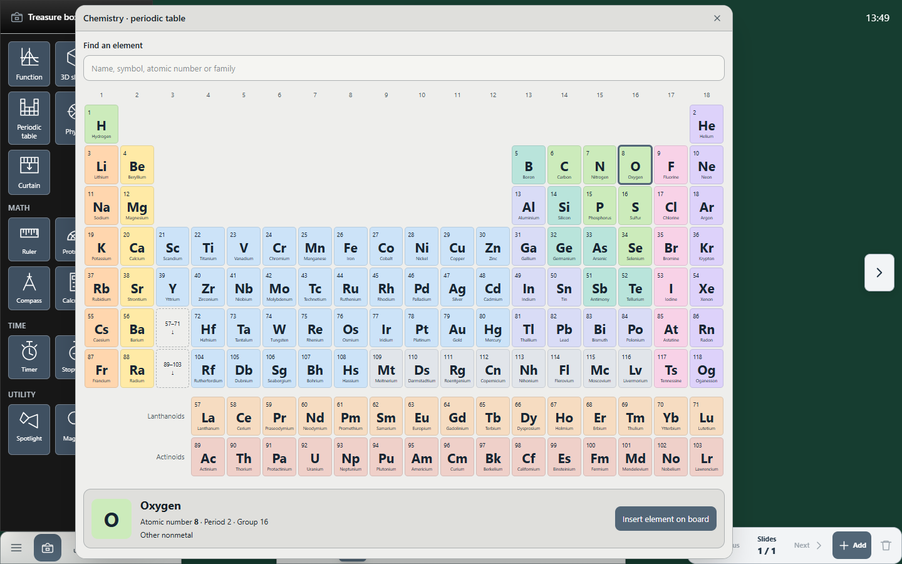
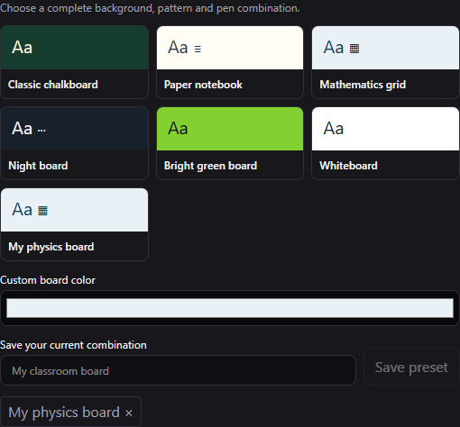

# Kopy Notes

**An open-source teaching whiteboard for browsers, Windows and Android smartboards.** Write, annotate documents, arrange slides and record lessons with an offline local library.

[**Try the web preview**](https://kopy-notes.netlify.app) | [MIT license](LICENSE) · [Setup](docs/SETUP.md) · [Features](docs/FEATURE_MATRIX.md) · [Builds and releases](docs/RELEASE.md) · [Changelog](CHANGELOG.md)

Version **0.2.0-dev.6 — development preview**. Contributions and bug reports are welcome; this is not a stable production release. Web workflows are tested; native installers and physical smartboard behavior still need device validation. Familiar classroom workflows are independently implemented, without redistributing Note3 or Excalidraw source/artwork.

PDF imports retain your selected page background and warm nearby pages. Interrupted drawings are offered for recovery before changing saved pages.

The optional `org-note3` appearance recreates the silver classroom controls. [Local artwork setup and ENB compatibility](docs/NOTE3_COMPATIBILITY.md) explain private theme packs, editable-ink import, preview fallbacks and experimental Note3 picture-page export.

Portable [theme packs](docs/THEME_PACKS.md) include colors, custom icons and background images. Small screens use a horizontal pen family and a pinnable More menu. The Windows app shows a startup screen while loading the classroom.

<a href="https://www.producthunt.com/products/kopy-notes?embed=true&amp;utm_source=badge-featured&amp;utm_medium=badge&amp;utm_campaign=badge-kopy-notes" target="_blank" rel="noopener noreferrer"></a>

Join [r/kopynotes on Reddit](https://www.reddit.com/r/kopynotes/) for classroom feedback, ideas and community discussions.

## Download the development version

[**Download APK, Windows EXE and web ZIP**](https://github.com/ADIxxDEV/kopy-notes/releases). Version tags automatically publish development prereleases with checksums and source code. Development APKs use a test/debug signature; Windows installers are unsigned. Release workflows build the native packages; real smartboard validation is still needed.

## Screenshots

Actual application screens with synthetic teaching examples:



| Import a document | Explore the periodic table |
| --- | --- |
|  |  |



## Start teaching

Use **Node.js 24** and npm:

```sh
npm ci
npm run dev
```

Open the displayed local URL, choose teaching defaults, and create a lesson. No account, subscription, paid API or other service is required. Setup supports your own app name/icon, board pattern, background, default pen color, watermark, physical ruler calibration, backup folders and optional Ollama assistant.

## Classroom tools

- Normal, pencil, paint, Chinese brush, crayon and stamp pens with pressure handwriting, highlighter, partial/whole-object erasing, editable temporary laser strokes, editable text, conservative smart shape recognition, undo/redo, multi-selection and corner resizing.
- Thirteen shapes; separate stroke/fill colors, thickness, solid/dashed/dotted lines, hatched/crosshatched fills and rounded rectangles.
- Transparent ruler, set square, protractor and compass with attached move/rotate/stretch grips, edge tracing, angle adjustment and arc/circle sweeps.
- Hand tool for panning into extra board space; original-position reset, zoom and fit-to-content.
- Slide thumbnails, visible Previous/Next buttons, mouse/touch/keyboard reorder, duplicate/add/delete and durable page order.
- Images, PDFs as slides or document objects, DOCX, editable basic PPTX and LibreOffice ODP slides. Landscape/portrait16:9,4:3 or custom import frames, nine anchors and independent margins. Lock, rotate, fit or align imported documents afterward.
- Edge-docked controls with optional floating mode, individually movable buttons/panels, named layouts and import/export: [control layouts](docs/CONTROL_LAYOUTS.md).
- Named board presets, custom default background/ink colors, patterns and reusable saved combinations.
- Searchable offline periodic table with all 118 elements, family colors, details and element-card insertion.
- [Science labs](docs/SCIENCE_TOOLS.md): series/parallel circuits, thin-lens ray diagrams, exact chemical equation balancing and dilution experiments, with board insertion and no external service.
- Four-direction screen curtain with touch dragging, keyboard adjustment and complete reveal.
- Scientific calculator with DEG/RAD, graph presets and configurable ranges, timers, subject diagrams, ideal buoyancy/displacement demonstration, camera snapshots, spotlight and magnifier.
- Canvas recorder with optional microphone and pause/resume. Floating tools/other apps are excluded; encoded-video reliability still needs real-device verification.
- Uncompressed editable .kopy documents, original attachments, legacy imports, autosave, three recovery generations and several synced backup folders.

Complex Office master layouts, binary PPT, macros, charts, animations, OCR and interactive3D are not fully supported. Export complex presentations to PDF for faithful appearance. See the [feature matrix](docs/FEATURE_MATRIX.md).

## Backup and integrations

Connect a folder already synced by Google Drive, OneDrive, Dropbox or Nextcloud on supported desktop browsers. The provider app uploads it; Kopy does not claim direct OAuth or live collaborative editing. Canva/Drive/OneDrive links guide export/download and import. Optional AI contacts your Ollama server only when you press Send; lesson files are never uploaded automatically.

Local storage belongs to this browser profile/origin. Clearing it removes the library. Keep external .kopy copies: [backups](docs/BACKUPS.md), [cloud folders](docs/CLOUD_BACKUPS.md), [file format](docs/KOPY_FORMAT.md).

## Verify and build

```sh
npm test
npm run build
npm run check:privacy
npm run check:release
npx playwright install chromium
npx playwright test
```

GitHub Actions validates the web and builds Windows installer and Android test APK artifacts. Matching development version tags automatically publish these under Releases alongside the web ZIP and checksums. Security checks scan Git history with Gitleaks, check source/build privacy patterns and dependency advisories. Release tags must match the package version and changelog. Stable signed APK builds need Android keystore secrets; development tags publish explicitly labelled debug APKs without secrets; Windows installers are currently unsigned. Read [packaging](docs/PACKAGING.md) and [release setup](docs/RELEASE.md).

Production dist runs on static HTTPS hosting and caches application code after first use. Camera/microphone require HTTPS or localhost. Development does not install the offline application cache.

## Open source

Original code and brand assets are MIT licensed. Fork, rename and modify the application. Runtime branding cannot change installed OS package identifiers; use build configuration for forks.

- [Contributing](CONTRIBUTING.md), [security](SECURITY.md), [dependency notices](THIRD_PARTY.md)
- [Customization](docs/CUSTOMIZATION.md), [brand assets](branding/README.md)
- [Reference review](docs/NOTE3_REFERENCE.md), [roadmap](docs/ROADMAP.md)

Maintained by [ADIxxDEV](https://github.com/ADIxxDEV) and contributors.

## Contributors

Thanks to everyone improving Kopy Notes. Public contributor profiles update automatically from GitHub commit contributions. Documentation, tests, accessibility, classroom feedback and code improvements are all welcome. Use [Issues](https://github.com/ADIxxDEV/kopy-notes/issues), [Discussions](https://github.com/ADIxxDEV/kopy-notes/discussions) or submit a pull request; see [Contributing](CONTRIBUTING.md).

<!-- CONTRIBUTORS:START -->
<p>
<a href="https://github.com/ADIxxDEV"></a>
</p>

[ADIxxDEV](https://github.com/ADIxxDEV)
<!-- CONTRIBUTORS:END -->

### Public website and teaching app

The public root serves a static, search-readable landing page; open `/#/app` to teach. Installed apps launch directly into teaching. The landing page includes social metadata, a sitemap, Product Hunt and Reddit links, and a clearly marked roadmap. Update the canonical URL, social URLs, robots.txt and sitemap.xml together if hosting changes.

The org-note3 theme and its artwork are included in web and native builds and cached for offline use. See THIRD_PARTY.md for the separate artwork terms.

### Support development

[Buy adixdev a coffee](https://www.buymeacoffee.com/adixdev) to support continued development.

<a href="https://www.buymeacoffee.com/adixdev"></a>
